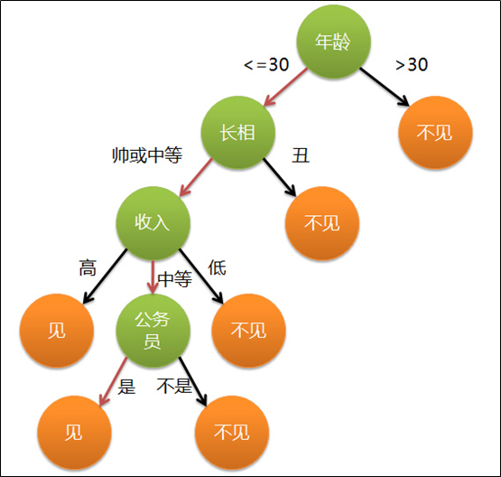
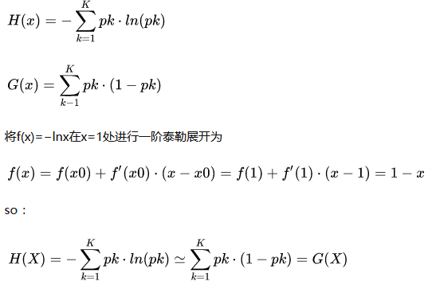

### 决策树

决策树是一种非常常用的传统机器学习算法，相较于贝叶斯、svm等其他算法，决策树具有一些明显的优势，就是在构建决策树的过程中不需要任何的领域知识，也不需要复杂的参数设置。这就使得决策树更适合于探测式的知识发现。

### 决策树的算法思想

#### 通俗版

参考[一篇文章](https://aaaedu.blog.csdn.net/article/details/105190163)的介绍，决策树的分类思想可以类比成相亲，比如说一个女孩子的妈妈托七大姑八大姨要给自己介绍一个男朋友，便有了下面的对话：

```
女儿：多大年纪了？
母亲：26
女儿：长的帅不帅？
母亲：挺帅的。
女儿：收入高不？
母亲：不算很高，中等情况。
女儿：是公务员吗？
母亲：是，公务员，在税务局上班呢。
女儿：那好，我去见见。
```

这这段对话就完整表达了一个决策过程，形成一个典型的分类树决策。



对于女孩决定是否见约会对象的策略中：

绿色代表判断条件

橙色代表决策结果

箭头表示决策途径

图中红色箭头表示了上面例子中女孩的决策过程。这幅图基本可以算是一颗决策树，说它”基本可以算“是因为图中的判定条件没有量化，如收入高中低等等，还不能算是严格意义上的决策树，如果将所有条件量化，则就变成真正的决策树了。

#### 概念版

从定义上来说，决策树是一个树结构（可以是而二叉树或非二叉树），其中每一个非叶子节点表示一个特征属性的判断，每一个分支表示这个特征属性的判断的分支，而每一个叶子存放一个类别。使用决策树进行决策的过程，就是从根节点开始，对待决策问题的特征属性进行判断，直到到达叶子节点，将叶子节点存放的类别作为决策结果。

### 决策树的构建

我们知道决策树会通过对特征属性的判断，形成分支，最后形成一个树状结构。但这里有一个问题，就是特征分割的前后顺序是怎样决定的。我们还是以女孩子相亲为例，年龄、长相、收入、职业等特征属性到底谁先判断谁后判断呢？

我们内心有一个标准就是：重要的评价标准肯定要先问。决策树也会为每次对特征的判断分割进行计算，找到一个最优解，并以这个最优的特征分割点作为当前的分割点。还是以相亲为例子，女孩子想了一下对相亲对象最重要的要求就是年龄不能超过30岁！所以就会将这个分割点放在最前面。

#### 决策树的分割点选择

决策树的每次分割，都是采用贪婪策略，就是选择特征分割的最优解进行划分。这个最优解的量化方法主要有熵、信息增益、信息增益比、基尼系数等多种方法。对于具体的分割方法，我们一起CART举例，通过伪代码的方法展示分割点的选择过程：

```
每个特征维度D：

​	每个特征值V：

​		将数据根据D-V分成两半

​		计算当前分割点的基尼系数

​		如果基尼系数小于当前最小基尼系数，那么就更新最小基尼系数，并设定当前分割点为最佳分割点

返回最佳分割的特征维度和特征值
```

##### 熵

熵一种信息论的概念，代表信息的期望。熵不能直接作为特征分割的量化标准。


S：表示一个数据集
t=p+n
p：正样本
n：负样本

##### 信息增益

信息增益是熵与条件熵的差值。条件熵是指将数据集进行分割成多个子数据集。并按照各个子数据集占数据集的比例作为权重，计算信息熵和加权和。信息增益是[ID3](https://baike.baidu.com/item/ID3%E7%AE%97%E6%B3%95/5522381#:~:text=ID3%E7%AE%97%E6%B3%95%E9%80%9A%E8%BF%87%E8%AE%A1%E7%AE%97%E6%AF%8F%E4%B8%AA%E5%B1%9E%E6%80%A7%E7%9A%84%E4%BF%A1%E6%81%AF%E5%A2%9E%E7%9B%8A%EF%BC%8C%E8%AE%A4%E4%B8%BA%E4%BF%A1%E6%81%AF%E5%A2%9E%E7%9B%8A%E9%AB%98%E7%9A%84%E6%98%AF%E5%A5%BD%E5%B1%9E%E6%80%A7%EF%BC%8C%E6%AF%8F%E6%AC%A1%E5%88%92%E5%88%86%E9%80%89%E5%8F%96%E4%BF%A1%E6%81%AF%E5%A2%9E%E7%9B%8A%E6%9C%80%E9%AB%98%E7%9A%84%E5%B1%9E%E6%80%A7%E4%B8%BA%E5%88%92%E5%88%86%E6%A0%87%E5%87%86%EF%BC%8C%E9%87%8D%E5%A4%8D%E8%BF%99%E4%B8%AA%E8%BF%87%E7%A8%8B%EF%BC%8C%E7%9B%B4%E8%87%B3%E7%94%9F%E6%88%90%E4%B8%80%E4%B8%AA%E8%83%BD%E5%AE%8C%E7%BE%8E%E5%88%86%E7%B1%BB%E8%AE%AD%E7%BB%83%E6%A0%B7%E4%BE%8B%E7%9A%84%E5%86%B3%E7%AD%96%E6%A0%91%E3%80%82%20%E5%86%B3%E7%AD%96%E6%A0%91,%E6%98%AF%E5%AF%B9%E6%95%B0%E6%8D%AE%E8%BF%9B%E8%A1%8C%E5%88%86%E7%B1%BB%EF%BC%8C%E4%BB%A5%E6%AD%A4%E8%BE%BE%E5%88%B0%20%E9%A2%84%E6%B5%8B%20%E7%9A%84%E7%9B%AE%E7%9A%84%E3%80%82)型决策树的分割标准。


D:表示一个数据集
D<sup>v</sup>:按照条件将数据集D划分成V个子数据集，其中的第v个子数据集
V：子数据集个数
Ent(D)：D这个数据集的信息熵

##### 信息增益比

当一个数据集被划分成非常多个子数据集，并且每个子数据集中的样本数都非常少时，信息增益中的条件熵就会变得非常小，导致信息增益有偏向性，为了应对这个问题，提出了信息增益比的分割标准。这个标准会引入数据集分割的信息熵，以平衡偏向性的影响。这个分割标准主要用于[C4.5](https://baike.baidu.com/item/C4.5%E7%AE%97%E6%B3%95/20814636)决策树中。


a：表示数据集的分割方法

##### 基尼系数

基尼系数是一种在经济上衡量居民收入差距的常用指标。由于其与熵模型的度量方式非常相近，并且计算简单，因此被用来代替熵的方法。


采用基尼系数作为分割标准的决策树是CART，也是目前主要是使用的决策树，普遍应用于bagging和boosting等集成学习的方法当中。同时基尼系数可以看成是信息增益的一阶泰勒展开。



需要注意的一点是，基尼系数追求的是最小值，熵相关的分割标准追求的是最大值（加不加负号的区别）。

#### 决策树的分割停止

如果让决策树一直分割下去，最终的结果就是每个叶子节点只有一个样本。这样显然会导致模型复杂度过高以及模型过拟合的问题。因此需要制定策略作为决策树停止分割的条件。

##### 最小样本数阈值

当该分支的样本集个数小于最小样本数时，分支停止分裂。

##### 熵的阈值

熵过小时，如果数据复杂度不大，就不需要继续分裂了。极端情况就是待分裂的样本都是同一类，这时候熵为0。

##### 决策树深度阈值

决策树的深度，决策树的深度就是所有叶子节点的最大深度，子节点比父节点深度加1，当某一分支的深度达到深度阈值，该分支停止分裂。

##### 无可分裂特征

当所有特征都是用完时，没有可以继续分裂的属性，就将当前节点作为叶子节点，并停止该分支的分裂。

#### 决策树的剪枝

决策树的剪枝一般分为两种方法，分别是预剪枝和后剪枝。

##### 预剪枝

预剪枝就是在决策树的构建过程中进行剪枝，在构造的过程中对节点进行评估，如果对某个节点进行划分时不能带来准确性的提升（损失函数的降低），那么对这个节点进行划分就没有意义，这时就会把当前节点作为叶节点，不对其进行划分。预剪枝容易导致欠拟合。

这里需要明确的是准确性的提升，就是对比未分割数据集和已经分割完成后，验证集之间的准确性。

   （0 1 0 1 1） -->验证集

​      (1 1 1 0 0)   -->训练集

​          /      \

​      /              \

(0 0 1)          (1  1)    -->验证子集

(0 0 0)          (1  1)    -->测试子集

划分前验证集的准确率：五个样本中，因为“1”样本较多，因此验证集的准确率=3/5=60%

划分后验证集的准确率：左子集有两个判断正确，右子集有两个判断正确，因此验证集的准确率=4/5=80%

##### 后剪枝

后剪枝就是在生成决策树之后再进行剪枝。通常会从决策树的叶子节点开始，逐层向上对每个节点进行评估。如果剪掉这个节点子树，与保留该节点子树在分类准确性上差别不大，或者剪掉该节点子树，能在验证集中带来准确性的提升，那么就可以把该节点子树进行剪枝。

### 决策时的实现方法

可以使用sklearn，或者自己写。