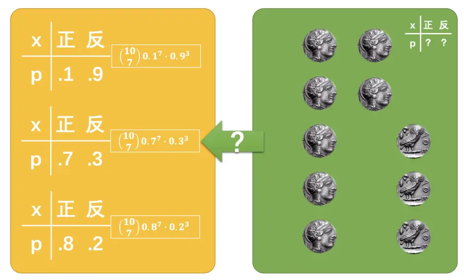

# 模型优化过程

有一种说法：机器学习本质上就是学习数据背后的规律，或者说用机器学习拟合数据的分布情况。而机器学习的作用就是在模型哪怕并不清楚任务的定义和规律，他依然可以算法模型的学习将这个规律给找出来。那么机器学习是怎么发现数据背后的规律的呢？首先就是猜一个预测结果，然后将预测结果和真实结果进行比较，根据预测结果和真实结果之间的差别进行调整，调整之后再比较，比较之后在调整。。。

猜测比较好理解，给出一个结果无论好坏；那么怎么将预测结果和真实结果进行比较呢？就是通过损失函数！如何调整预测结果呢？可就是优化算法！如何掌控调整的速度呢？设定学习率！这里我们先介绍损失函数。

举一个例子，对于一个未曾经过训练的神经网络，那么神经网络内部的参数$w$和$b$还都是“猜出来”的初始值。在不考虑结果好坏的情况下，没有经过训练的神经网络也可以完成一次预测。这个预测结果$\hat y$要和真实结果$y$之间肯定是存在差异的，我们需要有一个函数来量化二者之间的差异，这个函数就是损失函数。直白点说，损失函数就是来描述机器学习模型的靠谱程度的。

## 损失函数

### 最小二乘法

那么如何用损失函数来描述预测结果和真实结果之间差异呢？一个最简单的方法就是将预测结果$\hat y$和真实结果$y$做差，然后把这些差值都加起来,当这个结果取最小值时，表明预测结果和真实结果之间的差异最小，公式表示如下：
$$
Loss=\sum_{i=1}^n |\hat y_i-y_i|
$$
如何让这个损失函数最小呢，那就是对其求导，如果这个函数是下凸函数，那么一阶导数为0的时候，我们就找到了损失函数最小值。但是我们知道这个函数并不是在全定义内可导（当差值为0时不可导），因此我们对这个损失函数做了优化，就是把绝对值换成平方，同时增加一个$\frac{1}{2}$的系数，使损失函数求导后看着更简洁：
$$
Loss=\sum_{i=1}^n \frac{1}{2}(\hat y_i-y_i)^2
$$
而描述上面这个公式求取最小值的过程就是最小二乘法，二乘就是以前对平方的一种称呼。

### 最大似然估计

我们以抛硬币为例子，假如说我抛了10次硬币，结果7次正面3次反面。那是不是说抛硬币的时候正面的概率就是70%，反面就是30%呢？虽然这和我们的直观感受很类似，但事实上并不一定是这样的。因为你下次再抛10次硬币，可能6次正面4次反面。如果运气爆表可能10次都是正面！

也就是说我们根据抛硬币的结果很难唯一确定真实的概率分布（真实的概率分布就是抛硬币背后的规律）。虽然如此，我们仍可以根据抛硬币的结果确定最有可能的概率分布什么样的。

比如$C1$~$C10$代表十次抛硬币的结果，$\theta$表示硬币正面的属性(这个属性未知，可以将其理解为硬币固有的概率属性),那么抛10硬币硬币7次正面的概率公式如下：
$$
\begin{align}
P(C_1,C_2,C_3,...,C_{10}|\theta)
&=\begin{pmatrix} 10 \\ 7 \\ \end{pmatrix}\prod_{i=1}^{10}P(C_i|\theta)\\
&=C_{10}^7p^7(1-p)^3
\end{align}
$$
我们硬币正面的概率属性分别为0.1, 0.7, 0.8，我们就可以计算抛10次硬币7次正面的概率：

计算可以得出，当正面概率为0.7时，抛10次硬币7次正面的概率是最大的。所以我们说抛10次硬币7次正面，不能说明硬币正面的概率就是0.7，但是概率是0.7的可能性最大！这就是最大似然估计的思路。“最大”就是指可能性最大，“似然”就是指和真实概率分布的相似程度。

我们知道最大似然估计的函数形式是这样的：
$$
\mathcal{L}(\hat y,y)=-y\log \hat y-(1-y)\log(1-\hat y) 
$$
但是为什么这个函数形式就是最大似然估计的函数呢，我们以抛硬币为例子来进行推导：
$$
\begin{align}
&P(x_1,x_2,x_3,...,x_n,y_1,y_2,y_3,...,y_n|W,b),其中各个样本(x_i,y_i)之间是独立的\\
&=\prod_{i=1}^{n}P(x_i,y_i|W,b),其中P(A,B)=P(A|B)P(B)\\
&=\prod_{i=1}^{n}P(y_i|x_i,W,b)*P(x_i),其中x_i表示抛一次硬币，所以都是等概率的，因此P(x_i)是一个常量\\
&=\prod_{i=1}^{n}P(y_i|\hat y_i)*P(x_i),展开二项式分布\\
&=\begin{pmatrix} n \\ k \\ \end{pmatrix}\prod_{i=1}^{n}\hat{y_i}^{y_i}*(1-\hat{y_i})^{1-y_i}*P(x_i),其中\begin{pmatrix} n \\ k \\ \end{pmatrix}也是一个常数
\end{align}
$$
因此我们只需要对上式中的非常数部分去最大值，就可以获取最接近真实分布（背后的规律）的参数$(W,b)$了。
$$
\begin{align}
&\max P(x_1,x_2,x_3,...,x_n,y_1,y_2,y_3,...,y_n|W,b)\\
&=\max_{W,b} \xcancel{\begin{pmatrix} n \\ k \\ \end{pmatrix}}\prod_{i=1}^{n}\hat{y_i}^{y_i}*(1-\hat{y_i})^{1-y_i}\xcancel{*P(x_i)}\\
&=\max_{W,b} \log (\prod_{i=1}^{n}\hat{y_i}^{y_i}*(1-\hat{y_i})^{1-y_i})\\
&=\max_{W,b}\sum_{i=1}^n\log(\hat{y_i}^{y_i}*(1-\hat{y_i})^{1-y_i})\\
&=\max_{W,b}\sum_{i=1}^n(y_i*\log\hat y_i+(1-y_i)*\log(1-\hat y_i))\\
&=\min_{W,b}-\sum_{i=1}^n(y_i*\log\hat y_i+(1-y_i)*\log(1-\hat y_i))
\end{align}
$$
这就和开头展示的最大似然函数对应上了。通过最大似然函数，我们就可以根据当前数据集合的概率分布情况，找到可能性最大的真实概率分布。其实，最大似然估计法很多人也把它称为交叉熵法，这是因为极大似然估计法和交叉熵方法是彻彻底底的等价。

### 交叉熵

## 优化方法

梯度下降

批量梯度下降

随机梯度下降

牛顿法

拟牛顿法

共轭梯度法

EM算法

https://www.jianshu.com/p/76416e2d89f7#:~:text=%E6%9C%BA%E5%99%A8%E5%AD%A6%E4%B9%A0%E5%B8%B8%E8%A7%81%E7%9A%84%E4%BC%98%E5%8C%96%E7%AE%97%E6%B3%95%201%20%E6%A2%AF%E5%BA%A6%E4%B8%8B%E9%99%8D%E6%B3%95%202%20%E7%89%9B%E9%A1%BF%E6%B3%95%203%20%E6%8B%9F%E7%89%9B%E9%A1%BF%E6%B3%95%EF%BC%88DFP%E3%80%81BFGS%EF%BC%89%204,%E5%85%B1%E8%BD%AD%E6%A2%AF%E5%BA%A6%E6%B3%95%EF%BC%88Conjugate%20Gradient%EF%BC%89%205%20%E5%90%AF%E5%8F%91%E5%BC%8F%E4%BC%98%E5%8C%96%E6%96%B9%E6%B3%95%206%20EM%E7%AE%97%E6%B3%95%207%20%E5%B0%8F%E7%BB%93