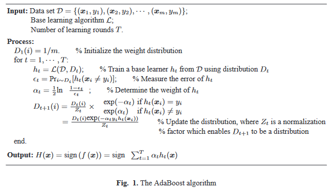
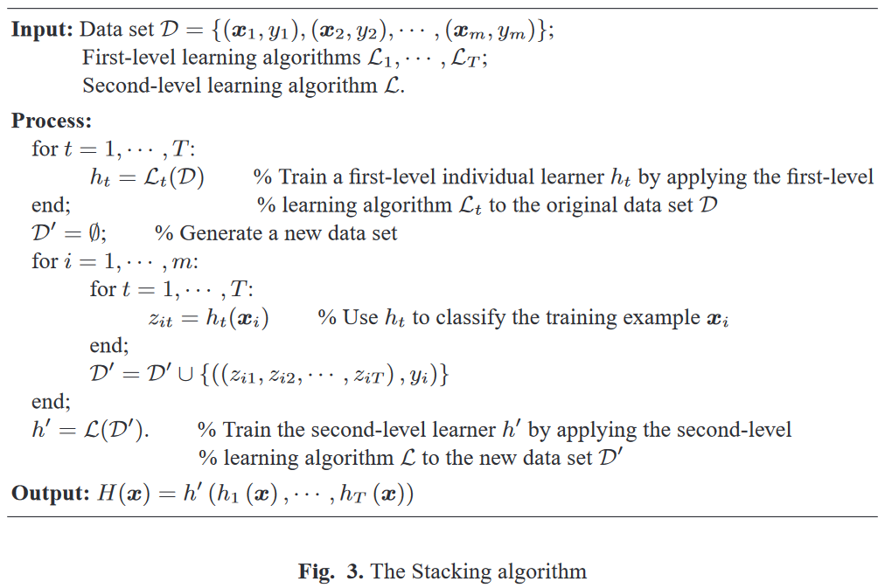

## 集成学习概述

集成学习（ensemble learning）本身不是一个单独的机器学习算法，是一种机器学习的范式，通过构架并组合多个机器学习算法模型来完成学习任务。集成学习属于一种策略，通过组合若干个个体学习器（individual learner），通过一定的组合策略，最终形成一个强学习器模型。

## 集成学习的分类

### 根据个体学习器的组合关系分类

根据个体学习器的组合关系，可以将集成学习分为串行集成学习和并行集成学习。

#### 串行集成学习

串行集成学习的原理是将上一个 个体学习器的分类错误的样本给一个较大的权重输入给下一个个体学习器。通过后续的个体学习器对之前分类错误的纠正，来提高模型的整体性能。

个体学习器1 ------------------------------->个体学习器2 ------------------------------->个体学习器3------->检测结果

​                         分类错误的样本加权                            分类错误的样本加权

#### 并行集成学习

并行集成学习是通过样本和特征的bootstrapping的方法来保证各个个体学习器之间的独立性和差异性，然后通过投票的方法给出最终分类结果，并通过个体学习器之间的独立性和差异性提高模型的抗过拟合能力。

个体学习器1---------------|

个体学习器2---------------|---------------->投票给出检测结果

个体学习器3---------------|

### 根据个体学习器的异同分类

#### 同质集成学习

各个个体学习器都是通过同一个基础算法生成的。

#### 异质集成学习

各个个体学习器是通过不同的基础算法生成的。

## 集成学习框架

### Bagging框架

Bagging可以理解为聚合引导的意思。通过bootstrap的方法将训练集划分为多个子训练集，并将每一个子训练集用来训练一个个体学习器，最终通过投票的方法获得最终预测结果。

#### Bagging的处理流程

如图：

#### Bagging的处理框架

如图：

#### Bagging的特点

因为Bagging通过bootstrap的方法构建了存在明显差异的个体学习器，因此这种架构可以有效的解决模型的方差问题。可以很好的缓解过拟合的问题。并且每个个体学习器都是强模型，有独立的分类能力，因此会Bagging会出现高偏差低方差的现象。

### Boosting框架

Boosting可以理解为是通过结合多个弱分类器的结果，形成一个强分类器。这里提到的弱分类器是指仅仅比随机猜测好一点点的模型，比如一个较小的决策树，或者一个简单的线性分割器。Boosting和Bagging的区别就是Bagging可以对个体学习器进行并行的训练；而Boosting需要利用加权后的数据对多个弱分类器依次的串行训练。

#### AdaBoost的处理流程

如图：

#### Boosting的处理框架

如图：

#### Boosting的特点

因为Bagging通过弱分类器的方法可以有很好的检测精度，因此这种架构可以有效的解决模型的偏差问题。可以很好的缓解欠拟合的问题。并且每个个体学习器都是弱模型，并没有独立的分类能力，因此会Bagging会出现低偏差高方差的现象。

### Stacking框架

Stacking框架与Bagging框架有一些类似，比如个体学习器都是强分类器，并且各个体学习器可以并行训练得出。不同的地方在于bagging的检测结果是对个体学习器检测结果的综合，但是Stacking框架是将个体学习器的检测结果作为最终检测模型的输入。简而言之，stacking把投票变成了另一个模型。

#### Stacking的处理流程

如图：

#### Stacking的处理框架

如图：

#### Stacking的特点

Stacking其实更符合大家对集成学习的猜想，相较于Bagging，它在个体学习器的检测结果之后，并没有简单的进行综合，而是将多个检测结果作为输入，训练一个新的元模型作为最终的分类器。基模型（个体学习器）其实更像是一种介于特征处理和检测模型中间的一种装置。

### Blending框架

blending框架是对Stacking框架的一种优化，主要是将基模型的训练数据和原模型的训练数据分开，这样就可以提高元模型与基模型的关联程度。更好的把基模型从一个检测模型转化成一个特征处理方式。而且这种处理方式可以降低人为的参与程度。

#### Blending的处理流程

流程如下：

1.将原始训练集T分为训练集Ttrain和验证集Tvalid

2.用Ttrain训练多个基模型

3.用多个基模型预测验证集Tvalid，将预测结果作为新的训练数据Tmate

4.用Tmate训练一个元模型

5.使用多个基模型对测试集进行预测，生成新的测试集

6.使用元模型对新生成的测试集预测，得出最终的结果。

#### Blend的处理架构

如图：

#### Blend的特点

对Stacking的优化，原始训练数据集分成训练数据集和验证数据集，通过训练数据集训练基模型，并将基模型作为特征处理方法对验证数据集进行进一步的特征处理。

