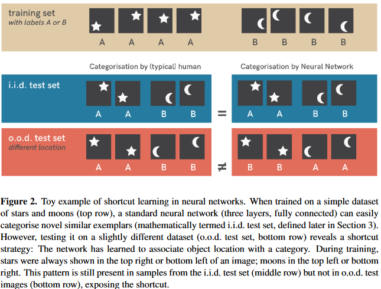
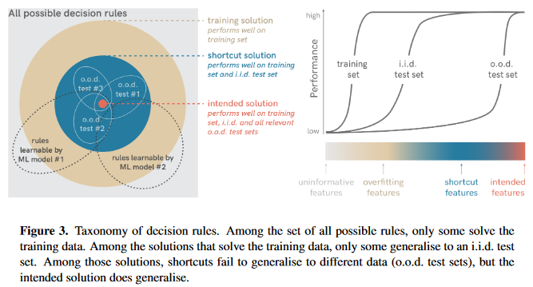
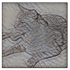

论文名称：Shortcut Learning in Deep Neural Networks

论文下载地址：[https://arxiv.org/pdf/2004.07780v3.pdf](https://arxiv.org/pdf/2004.07780v3.pdf)

黑色文字：文中观点

红色文字：笔者观点

### 深度学习没有捷径可走

深度学习因为其优异的学习能力，是人工智能中当之无愧的主力军。深度学习在NLP和CV等领域都得到了很好的应用。但是深度学习统一存在一个无法忽视的问题：捷径学习。这种捷径的具体表现是在标准数据集中表现优异，但是在更具挑战性的测试条件下表现就会大打折扣。基于这种情况论文一系列关于模型解释和基准测试的建议，以提高深度学习模型在实际场景中的可用性。

数学和物理等理论经过多个世纪的研究，已经有了很个经得住实际情况考验并且完全自洽的理论体系，但是深度学习的研究才刚刚兴起，因此并没有形成理论和原则。因此很多时候深度学习的检测能力都是在一定数据集上进行检测指标的量化，这种结果导向的行为有些时候确实体现了模型的检测能力，但同时与当前所使用的数据集深深绑定。

深度学习的检测能力在达到人类的水平的同时也出现了图1中所显示的问题，第一个图中将绿色的山坡识别为放牧的羊，第二个图中识别出了茶壶，第三个图中深度学习无法识别肺炎，因为模型主要关注的特征是右上角的医院标识信息。第四个图中因为加入无关信息导致模型无法回答问题，因为模型主要关注的特征是一段文字中的最后一句话。

随着深度学习在各个领域的应用，这种实际的问题让研究人员开始思考：深度学习什么时候可以发挥作用，当模型检测失败的时候，我们需要知道为什么？这也是深度学习因为不可解释性的一个明显问题，当深度学习检测出现错误时，就很难反推失败原因，而这时候以结果为导向的特性和黑盒的特性并不能为纠正错误提供帮助。

通过分析如图1中大量深度学习失败的案例，很多时候深度学的检测能力是超过人类本身的，但是有些时候对输入数据进行细小或者说人眼难以发现的修改，就会导致很大程度的影响检测结果。举例来说在人脸识别中，如果对图像进行镜面对称处理，这些经过镜面对称处理的图像就会使模型产生大量的误判。这种微小的修改导致模型检测结果严重失准的特点也催生了一个针对深度学习的攻击行为：对抗攻击。

捷径学习是所有学习过程中都存在的，无论是动物还是深度学习模型。比如说你熟读《水浒传》对小说里面的任务性格和故事都了如指掌。但是有一天有一个老师问你：水浒传中108将一共说了多少句脏话？这一下就难住了你了，因为你学习的《水浒传》内容与考试内容完全不相关。

捷径的定义是决策规则的分类。图2对结晶学习进行一个简单的举例，人类的学习的知识是方块中的图形，而神经网络学习的就可能是方块中图形的位置。神经网络关于位置信息的学习在有限的测试集中效果很好，但是更换了测试集后就会出现大量的误报。捷径学习在深度学习中并不是一个新生的现象，作为原生特点，结晶学习的问题一直存在，只是在与传统机器学习方法的比较中被忽视了，并且在还没有走入工程化应用的研究阶段没有充分暴露出来。

这对这种情况，论文对模型对应的数据分布和特征权重进行了分析，结果如图3所示。可以看出不同的数据集会训练出不同的模型，并且检测模型在整个的数据分布中有明显的局限性。并且对比了不同数据集中的特征情况，这也很好的解释了模型在新的场景下新测试集检测结果糟糕的原因-给错误的特征以过高的权重。

### 捷径学习是如何形成的

那么捷径学习是从何而来？为了缓解捷径学习如何缓解呢？第一种就是来自捷径特征，第二个是来自判别模型。二者在影响捷径学习的同时也在影响机器学习模型是否能脱离研究环境的重要因素。

#### 数据中的捷径因素

深度学习模型在训练的过程中，如果背景信息都是一样的，那么这些背景信息也会成为目标识别的重要特征。举例来说一个深度学习模型被训练来检测牛，但是这些牛都是在草原中 ，换句话说训练牛的数据集的背景信息都是蓝天绿草，而不是沙滩、海水等其他背景信息。这也就会导致蓝天绿草相对于沙滩海水有着更大的特征权重。在论文XXX中这种有问题的机器学习算法问题也被叫做数据偏差（dataset biases）。即使在大数据的情况下数据的捷径因素依然存在，因为这不是数据的规模问题，而是数据产生的场景本身存在局限性。举例来说你在草原上无论拍多少张牛的照片，依然无法解决蓝天绿草的背景特征问题。这种训练数据集的有限性无法体现场景的实际数据分布，因此产生盲人摸象的效果。                                                                                                                   

#### 判别算法中的捷径因素

根据论文[ImageNet-trained CNNs are biased towards texture; increasing shape bias improves accuracy](https://arxiv.org/pdf/1811.12231.pdf)，以及github代码路径[https://github.com/rgeirhos/texture-vs-shape](https://github.com/rgeirhos/texture-vs-shape)。

由上面的论文中可以看出纹理特征的检测结果非常好，因此在CNN的各种卷积操作中，纹理特征获得权重也会更大，更重要的是，在端到端的训练工程中，这种纹理特征的权重是算法自己训练得出的，并非人类强加给深度学习模型的。但是这与人类视觉观察判断是不是猫存在明显不同，人眼会很重视目标的物体的外部轮廓特征，与此同时忽略了其他的重要特征信息。因此深度学习模型因为对纹理特征的较大权重，就导致对某些图片的误判，例如下面的这个猫就被识别成了大象。

在不同的场景下，这种情况存在十分普遍，如下图所示。

### 深度学习中的捷径学习

捷径学习在深度学习的多个场景下广泛存在：例如CV、NLP、增强学习、推荐系统等多个方面.

### 理解和诊断捷径学习

因为捷径学习一直存在，因此针对捷径学习的研究一直存在，答案是没有形成体系，接下来主要理解和诊断捷径学习。

#### 诊断检测结果

##### 区分模型在测试集的检测能力和其真实潜力

很多时候机器学习模型在IID上检测效果优异，但是在OOD中的性能很差。如果模型的在OOD的检测结果很好，那就说明模型的泛化能力较好，敏捷学习对该模型的影响较低。也就说模型在面对未知时是有潜力的。

##### 机器学习中的摩根法则

有些观点认为神经网络是模拟动物神经网络的结构，但是我们不能倾向于神经网络的训练和测试的过程就是动物大脑的学习和应用的过程，这两者之间存在明显的区别。归纳来说就是类似人类的行为并不意味着类似人类的决策方式，在深度学习中，可以被捷径学习充分解释的情形就不要将其归纳为更高级的能力。

##### 通过极限模型分析捷径学习

判断检测结果是否存在捷径学习，可以通过基线模型进行分析。可能基线模型和最终模型之间在检测能力上存在一些差异，但是通过基线模型也可以分析当前方法是否存在捷径学习的风险。最主要的一点，我们不能混淆检测检测模型在IID上的检测能力和在OOD上的检测能力。

#### 面向OOD的测试数据集

##### 将OOD检测作为能力检测的标准

在评价模型的检测能力时，主要考虑模型对OOD的检测能力，不能考虑单纯参考IID的检测能力。

##### 设计一个好的OOD数据集

一个好的OOD数据集要有以下的条件，第一要有明确的分布变换，这种变化可以人为的区分也可以不是。第二，良好的OOD测试都应该存在让模型难以检测，比如在图像处理时，可以在OOD测试集的图像中添加一些白噪声。第三，测试数据集中可以包含训练中不包含的数据，也就是一些让模型难以检测的极具挑战的数据。以下是一些举例。

#### 为什么会学习会变成敏捷学习

##### 最小努力原则

为什么机器学习这么容易造成敏捷学习呢？有一个最小努力原则，就是说话的时候大家都喜欢说更小的词汇，比如用phone代替mobilephone，用plane代替airplane。学习也是一样，会用最简单最直接的特征进行学习。

##### 理解归纳偏差的影响

机器学习的影响不仅仅依赖于数据，也会依赖机器学习算法的四个组成部分：架构、训练数据、损失函数、优化方法。通常训练过程从数据输入模型开始，这个模型包含固定的架构和随机的初始化参数，通过对比预测结果和ground truth，通过损失函数明确优化方向和预测的质量。综合这四个组成部分从算法层面明确了算法模型是否容易引起敏捷学习，而不是与其解决方案。

### 如何优化敏捷学习

在整个机器学习过重，很难明确OOD的的泛化情况。由于对IID模型的过渡研究，就会导致明显的敏捷学习。接下来会提供一些优化敏捷学习的方法。

#### 研究领域的先验知识

基于研究方向的先验知识，鼓励机器学习架构和数据增强的方法鼓励算法过于无关特征。可以通过白噪声或者切割、旋转增强检测模型在图像处检测中对无关特征的依赖。

#### 对抗样本和鲁棒性

通过对抗样本可以优化模型的泛化能力，对抗样本可以理解为模型中弱点。通过对抗样本测试模型，可以优化模型的泛化能力。

#### 适应样本分布

通常在训练过程后模型会模拟数据分布情况。对于模型，明确模型模拟的数据分布以外的数据泛化能力。

#### 样本均衡

由于数据样本存在数据不均衡的情况，并且模型也会因为样本数据的不均衡会忽略样本较少的数据分布，因此需要通过数据增强或者算法优化实现对不同数据分布的公平处理。

#### 元学习

我的理解元学习就是迁移学习，先训练一个模型使其拥有学习的能力，再用这个模型去学习另外一个问题。

#### 生成式建模和解耦

分析模型检测结果，明确数据特征与检测结果之间的关系，目标就是在通过独立的因果机制从观察中回复数据分布的真实原因，这些信息主要是通过分析模型对不同特征的权重获得的。

### 结论

1.敏捷学习无处不在，只能缓解不能去除。

2.应对敏捷学习需要认真分析检测结果。

3.检测模型的能力，需要构建合理的OOD测试集。

4.对模型的理解会让其更好的学习，这个理解需要包括算法架构（结构）、数据（经验）、损失函数（目标）、优化方法（学习）。